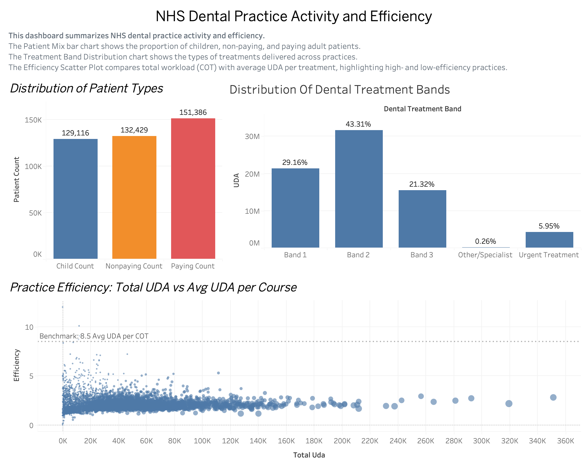

# NHS Dental Activity Dashboard

**Project Status**
Completed portfolio project demonstrating healthcare data analysis and Tableau dashboard development using NHS dental activity data.

---

**Project Overview**
This project analyses NHS dental activity data to explore treatment distribution, patient mix, and practice efficiency across dental providers.

The objective is to understand how NHS dental services are delivered and identify patterns in workload and productivity using publicly available healthcare data.

The analysis was conducted using a **clinically validated dataset** and visualised through a Tableau dashboard.

---

**Table of Contents**

* Project Overview
* Dashboard Preview
* Objectives
* Dataset
* Data Preparation
* Project Workflow
* Dashboard Visualisations
* Dashboard Interpretation
* Key Insights
* Tools Used
* Skills Demonstrated
* Repository Files
* Project Purpose

---

**Dashboard Preview**

---

**Objectives**
This project addresses three key questions:

1. What is the distribution of NHS dental treatment bands?
2. What proportion of treatments fall into different patient categories?
3. How do dental practices compare in terms of efficiency and workload, filtering out clinical data errors?

---

**Dataset**
The dataset used in this project comes from publicly available NHS dental statistics.

**Processed dataset: `nhs_dental_activity_processed.csv**`
Cleaned and structured dataset where clinical outliers (UDA/COT > 15) have been removed to ensure data integrity.

**Raw dataset: `nhs_dental_activity_raw.csv**`
Original dataset containing raw clinical records and data entry anomalies.

---

**Data Preparation**
Several preparation steps were performed to rectify the data before building the dashboard:

* **Clinical Filtering:** Used SQL to remove records with impossible UDA/COT ratios (records > 15). Standard NHS Band 3 treatments are 12 units; higher values represent data entry errors.
* **Weighted Aggregation:** Structured the data to allow for weighted efficiency calculations ($\sum UDA / \sum COT$) rather than simple row-level averages.
* **Structuring treatment band categories:** Standardised Band 1, 2, and 3 classifications.

---

**Project Workflow**

1. NHS dental activity dataset obtained from publicly available NHS statistics.
2. **SQL Data Rectification:** Filtered outliers and aggregated activity by practice and treatment band.
3. Cleaned dataset exported as `nhs_dental_activity_processed.csv`.
4. Dataset imported into Tableau.
5. **Calculated Field Creation:** Created a weighted `True Clinical Efficiency` metric using the `AGG` function to ensure mathematical accuracy.
6. Dashboard created to analyse treatment distribution, patient mix, and practice efficiency.

---

**Dashboard Visualisations**

**Patient Mix**
Shows the proportion of treatments delivered to Paying, Non-paying, and Child patients.

**Treatment Band Mix**
Visualises the distribution of NHS treatment bands (Band 1, 2a/b/c, 3, Urgent, etc.).

**Practice Efficiency Scatter Plot**
Compares total UDAs delivered against **AGG (True Clinical Efficiency)**.

Each point represents an individual dental practice. By using aggregated calculations and SQL filtering, the scatter plot now reflects a realistic clinical range (1–12 UDA per treatment), identifying genuine performance trends rather than data errors.

---

**Dashboard Interpretation**
The dashboard enables comparison of dental practices in terms of workload and efficiency.

Practices positioned higher on the scatter plot deliver more UDAs per course of treatment. Because the data has been cleaned of outliers, a high position now correctly indicates higher treatment complexity rather than faulty data.

---

**Key Insights**

* **Data Integrity:** Identified that raw datasets contain anomalies that must be filtered to prevent skewed management decisions.
* **Efficiency Benchmarking:** Most practices cluster between 5 and 8.5 UDA/COT after filtering clinical errors.
* **Service Delivery:** Band 2 treatments represent the highest volume of non-preventative clinical work.

---

**Tools Used**

* **SQL:** For data auditing, outlier removal, and aggregation.
* **Tableau:** For advanced clinical visualization and weighted metrics.
* **NHS Public Datasets**

---

**Skills Demonstrated**

* **Clinical Data Validation & Auditing**
* Healthcare data analysis
* Data cleaning and preparation (SQL)
* Weighted aggregation logic (Tableau AGG)
* Dashboard design and storytelling
* GitHub project documentation

---

**Repository Files**

* **`dashboard.twbx`**: Updated Tableau workbook containing the rectified calculations.
* **`nhs_dental_activity_processed.csv`**: The clinically validated dataset.
* **`nhs_dental_activity_raw.csv`**: Original data for transparency.
* **`clinical_audit.sql`**: SQL script used to rectify the dataset.

---

**Project Purpose**
This project was created as part of a personal portfolio to demonstrate practical skills in healthcare data analysis and health informatics. By identifying and fixing clinical data errors, it showcases the ability to provide reliable insights for healthcare decision-makers
