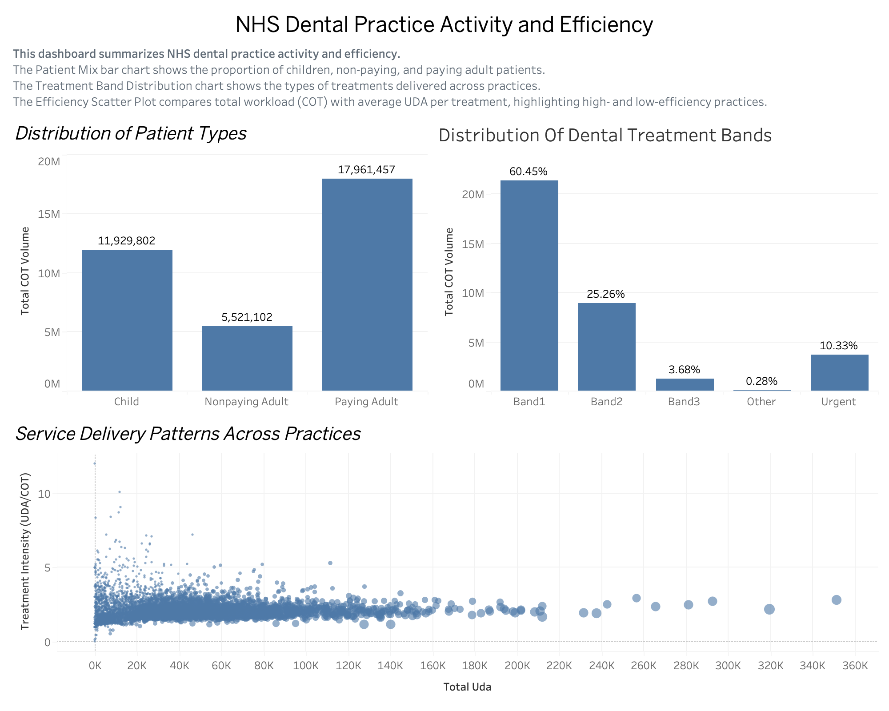
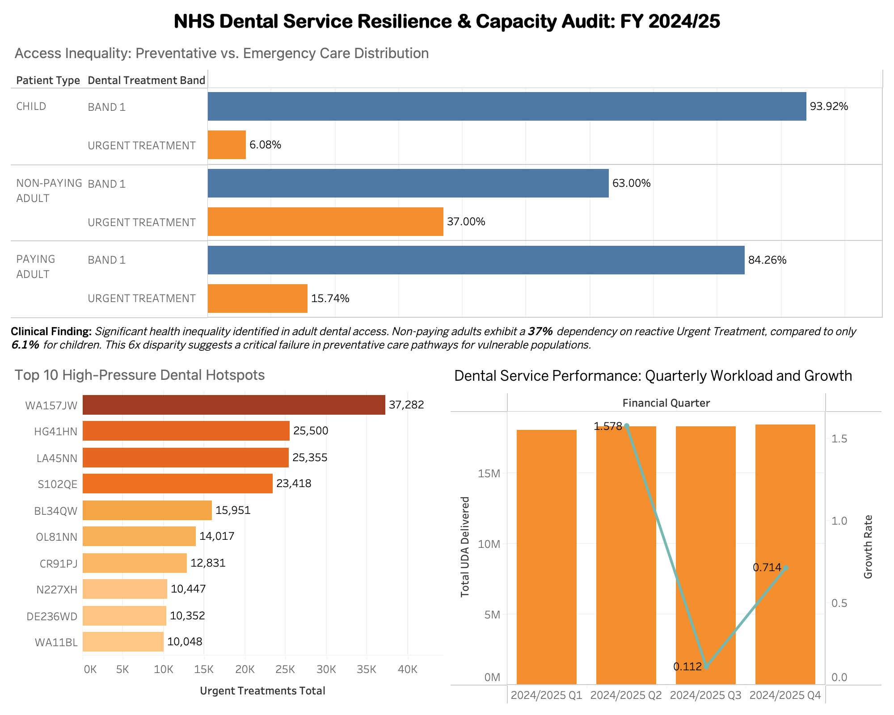

# NHS Dental Service Delivery & Access Pressure Analysis

**Data Source:** NHS Business Services Authority (BSA) Open Data — Financial Year 2024/25  
**Tools:** SQL (DB Browser for SQLite), Tableau  
**Status:** Complete

---

## What This Project Is About

I wanted to look at whether NHS dental services are actually keeping up with patient demand, and where the pressure points are. The NHS BSA publishes dental activity data at practice level, broken down by treatment band and patient type — it's detailed enough to ask some genuinely useful questions, but messy enough to need careful handling before you can trust the numbers.

The core question I tried to answer was:

> *Is NHS dental service delivery keeping up with patient demand over time, and which patient groups and geographic areas are bearing the most pressure?*

That breaks down into three sub-questions:
1. How has dental activity changed quarter by quarter through 2024/25?
2. Are certain patient groups relying disproportionately on urgent/emergency care rather than routine treatment?
3. Which practice postcodes are carrying the heaviest urgent care burden?

---

## Data Workflow
Before any analysis, we gathered raw NHS dental activity data at the practice level. This dataset required significant cleaning and standardization to ensure reliable results. We removed nulls, validated patient types, and restructured columns for easier analysis.

Once the data was prepared, we aggregated it to calculate key metrics such as total UDA delivered, courses of treatment by band and patient type, and urgent care volume by postcode. These metrics were then visualized in Tableau, providing clear insights into service delivery trends, patient access patterns, and geographic pressure points.

This workflow—from raw data gathering to cleaning, analysis, and visualization—ensures that every chart and finding reflects accurate, trustworthy information rather than unprocessed source data.

---

## Dashboards

### Dashboard 1 — Practice Activity Overview



Three views here:

- **Patient type distribution (COT volume)** — paying adults account for the largest share of clinical activity at 17.9M courses, followed by children at 11.9M. Non-paying adults are notably lower at 5.5M — which when read alongside Dashboard 2 suggests this group is accessing the service less overall but relying more heavily on urgent care when they do.
- **Treatment band distribution (COT volume)** — Band 1 dominates at 60.45%, meaning the majority of NHS dental activity is routine and lower-acuity in nature. Band 2 accounts for 25.26%. Urgent treatment makes up 10.33% of total COT volume — a meaningful proportion given it represents unplanned, crisis-driven demand.
- Both Charts use COT (Courses of Treatment) rather than UDA to show actual patient episodes, reflecting the true workload regardless of treatment complexity.
- **Service delivery pattern across practices** — Plots total UDA against average UDA per course of treatment for each practice. Most practices cluster around lower UDA per course, indicating more routine Band 1 care (check-ups, x-rays). As total UDA increases, this trend strengthens, with high-volume practices delivering a higher share of simpler treatments rather than more complex Band 2 or Band 3 work.

---

### Dashboard 2 — Access Equity & System Pressure



Three views here:

- **Access inequality — preventative vs emergency care by patient type**  
  This was the most striking finding. Children access routine Band 1 care 93.92% of the time, with only 6.08% urgent. Non-paying adults are almost the reverse — 37% of their dental contacts are urgent treatments. Paying adults sit in between at 15.74% urgent. This pattern is consistent with what you'd expect from a system where cost and access barriers push certain groups toward crisis-only care.

- **Quarterly growth**  
  The quarter-on-quarter growth rate peaked in Q2 at 1.578, dropped sharply to 0.112 in Q3, then partially recovered to 0.714 in Q4. Quarterly fluctuations likely reflect seasonal variation, but when combined with high urgent care reliance in certain groups, they may indicate uneven access to routine care rather than true demand reduction.

- **Top 10 high-pressure dental hotspots**  
  Ranked by raw urgent treatment volume. One postcode stands out as a clear outlier, with significantly higher urgent activity than the rest.
Outliers like this are typically driven by structural factors rather than purely local demand. These can include high-volume practices, centralised urgent care providers, or locations serving a wider catchment area. As postcode-level data reflects provider location rather than patient origin, high volumes often mean activity is concentrated at one site rather than spread across the area.

While a relative measure such as percentage-based pressure (urgent care as a share of total activity) was considered, it was not used here because it can be misleading at the postcode level. Smaller or specialist urgent care centres often appear as 100% by definition, which does not necessarily indicate system strain. Using raw urgent volume provides a clearer view of where the actual workload burden sits, making it more useful for identifying areas that may require additional resources or capacity.

---

## SQL Pipeline

The project follows a clean end-to-end pipeline. All queries are in the `/sql` folder.

| File | Purpose |
|---|---|
| `cleaning_the_data.sql` | Standardises formatting, removes nulls, validates patient types |
| `quarterly_summary.sql` | Total UDA and COT by financial quarter |
| `urgent_pressure_by_postcode.sql` | Top 10 postcodes by urgent treatment volume |
| `patient_type_impact.sql` | Band 1 vs urgent care split by patient type |
| `service_pressure_index.sql` | Urgent care as % of total workload per practice |
| `quarterly_recovery_trend.sql` | Quarter-on-quarter UDA growth using LAG window function |
| `dental_practice_master_volume.sql` | Full practice-level breakdown — COT by band, patient type, workload intensity |

---

## Key Findings

- Non-paying adults experience urgent care at a rate six times higher than children — a clear equity signal that cost and access barriers are shaping how different groups use the service.  

- One postcode stands out as a significant outlier in urgent demand, nearly 50% higher than the next highest, indicating a concentrated area of activity.  

- UDA delivery increased overall through 2024/25, but not evenly — growth accelerated in Q2, dropped in Q3, then partially recovered in Q4, suggesting seasonal variation rather than consistent system improvement.  

- Band 1 dominates the treatment mix at 60.45% of COT volume, indicating that most NHS dental activity is routine and lower-acuity in nature — examinations, x-rays, and minor interventions rather than complex treatment.
  
- Taken together, these patterns suggest that while overall activity is increasing, access to routine care remains uneven, with certain groups and areas relying more heavily on urgent treatment.
---

## Repo Structure

```
nhs-dental-dashboard/
│
├── README.md
├── dashboards/
│   ├── dashboard_1_practice_overview.png
│   └── dashboard_2_access_performance.png
├── sql/
│   ├── cleaning_the_data.sql
│   ├── quarterly_summary.sql
│   ├── urgent_pressure_by_postcode.sql
│   ├── patient_type_impact.sql
│   ├── service_pressure_index.sql
│   ├── quarterly_recovery_trend.sql
│   └── dental_practice_master_volume.sql
├── data/
│   ├── dtable_raw          ← original NHS BSA download
│   ├── dtable_cleaned      ← output of cleaning_the_data.sql
│   └── source_note.md
└── outputs/
    ├── quarterly_summary.csv
    ├── quarterly_recovery_trend.csv
    ├── urgent_pressure_by_postcode.csv
    ├── service_pressure_index.csv
    └── patient_type_impact.csv
```

## How This Project Answers the Questions

This project was designed to directly answer the overarching question:

> *Is NHS dental service delivery keeping up with patient demand over time, and which patient groups and geographic areas are bearing the most pressure?*

It does so by addressing each of the sub-questions:

1. **Quarter-by-quarter dental activity changes**  
   The quarterly summary and recovery trend queries track total UDA delivered across the four financial quarters of 2024/25. The LAG-based recovery trend query calculates quarter-on-quarter growth directly, showing where delivery accelerated, where it contracted, and where it recovered. UDA is used as the primary measure as it is the core NHS contractual metric for dental activity.

2. **Patient group reliance on urgent vs routine care**  
   The patient type impact query compares Band 1 and urgent treatment volumes across children, non-paying adults, and paying adults. Dashboard 2 visualises this as a percentage split per group, making the access inequality immediately visible. Non-paying adults show the highest urgent care dependency at 37%, compared to 6.08% for children — the most significant equity finding in the project.

3. **Practice-level and geographic pressure points**  
   The urgent pressure by postcode query ranks practices by raw urgent treatment volume. This approach was chosen deliberately — a percentage-based pressure index was computed but not visualised, as the top-ranked postcodes showed close to 100% urgent treatment when sorted by ratio. This could reflect specialist or single-purpose practices rather than genuine system strain, though this was not investigated further. Raw volume was used instead as a more straightforward measure of where urgent demand is concentrated.

## What This Means for the NHS

- **Target access gaps**  
  Patient groups with high reliance on urgent care may benefit from improved access to routine appointments, particularly in areas where preventative care uptake is low.

- **Focus on high-pressure areas**  
  Postcodes with consistently high urgent activity can be prioritised for additional capacity, such as extended hours or targeted resource allocation.

- **Plan for seasonal variation**  
  Fluctuations in quarterly activity suggest that workforce and appointment availability should be adjusted proactively throughout the year to maintain consistent service delivery.

- **Use data for ongoing monitoring**  
The urgent care rate, UDA delivery trends, and postcode-level demand patterns used in this project can be applied continuously to track changes in access, demand, and service pressure over time.
